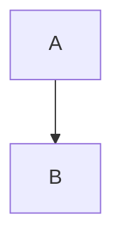

# Test Design: Story 10.6 - Markdown Syntax Highlighting

**Date:** 2026-01-28
**Designer:** Quinn (Test Architect)
**Story:** 10.6 - Markdown Syntax Highlighting (Code View)

## Test Strategy Overview

| Metric | Value |
|--------|-------|
| Total test scenarios | 32 |
| Unit tests | 22 (69%) |
| Integration tests | 6 (19%) |
| E2E tests | 4 (12%) |
| **Priority distribution** | P0: 10, P1: 12, P2: 8, P3: 2 |

### Strategy Rationale

This story implements syntax highlighting for Markdown in Rust with WASM bindings. The architecture follows established patterns (`highlighter.rs`, `xml_highlighter.rs`). Given the security-first nature of this tool (handling sensitive data), XSS protection receives P0 priority. Performance is also P0 due to explicit 200ms target. Pattern-matching correctness is P1 (core user experience), while theme integration is P2 (secondary UI polish).

**Test level distribution reasoning:**
- **Unit tests (69%):** Highlighting is pure function logic - ideal for fast, isolated unit testing
- **Integration tests (19%):** WASM binding validation and bridge layer interaction
- **E2E tests (12%):** Visual verification in browser with theme switching

---

## Test Scenarios by Acceptance Criteria

### AC1: Markdown syntax highlighted in Code view with Theme.qml colors

| ID | Level | Priority | Test | Expected Result | Justification |
|----|-------|----------|------|-----------------|---------------|
| 10.6-UNIT-001 | Unit | P1 | Verify heading generates `md-heading` class | `# Title` → `<span class="md-heading"># Title</span>` | Pure function output verification |
| 10.6-INT-001 | Integration | P1 | Theme.qml colors applied via CSS variables | `.md-heading` uses `--syntax-heading` color | Component interaction: Rust output + QML theme |
| 10.6-E2E-001 | E2E | P2 | Visual confirmation of highlighted Markdown | Headings display in blue (dark) / dark blue (light) | User experience validation |

---

### AC2: Markdown elements highlighted with appropriate styling

#### Headings (`#`, `##`, `###`, etc.)

| ID | Level | Priority | Test | Expected Result | Justification |
|----|-------|----------|------|-----------------|---------------|
| 10.6-UNIT-002 | Unit | P1 | H1 heading pattern | `# Heading` → `<span class="md-heading">...</span>` | Pattern matching correctness |
| 10.6-UNIT-003 | Unit | P1 | H6 heading pattern | `###### H6` correctly wrapped | Edge case: max heading level |
| 10.6-UNIT-004 | Unit | P2 | Invalid heading (no space) | `#NoSpace` not highlighted as heading | False positive prevention |
| 10.6-UNIT-005 | Unit | P2 | Heading with inline formatting | `# **Bold** Heading` preserves nested formatting | Complex pattern interaction |

#### Bold and Italic

| ID | Level | Priority | Test | Expected Result | Justification |
|----|-------|----------|------|-----------------|---------------|
| 10.6-UNIT-006 | Unit | P1 | Bold text pattern | `**bold**` → `<span class="md-bold">**bold**</span>` | Core formatting |
| 10.6-UNIT-007 | Unit | P1 | Italic text pattern | `*italic*` → `<span class="md-italic">*italic*</span>` | Core formatting |
| 10.6-UNIT-008 | Unit | P2 | Nested bold in italic | `*text **bold** more*` correctly nested | Pattern complexity |
| 10.6-UNIT-009 | Unit | P1 | Strikethrough pattern | `~~struck~~` → `<span class="md-strike">...</span>` | Story requirement |
| 10.6-UNIT-010 | Unit | P2 | Unbalanced asterisks | `**unclosed` remains unformatted | Error handling |

#### Code (Inline and Blocks)

| ID | Level | Priority | Test | Expected Result | Justification |
|----|-------|----------|------|-----------------|---------------|
| 10.6-UNIT-011 | Unit | P1 | Inline code pattern | `` `code` `` → `<span class="md-code-inline">...</span>` | Core formatting |
| 10.6-UNIT-012 | Unit | P1 | Code block with language | ` ```js\ncode\n``` ` → `<span class="md-code-block">...</span>` | Fenced code blocks |
| 10.6-UNIT-013 | Unit | P1 | Code block content preservation | Code inside block NOT highlighted | Spec: no inner highlighting |
| 10.6-UNIT-014 | Unit | P0 | Unclosed code block at EOF | ` ```rust\nfn main()` produces valid HTML | Reliability: SEC-001 mitigation |

#### Links

| ID | Level | Priority | Test | Expected Result | Justification |
|----|-------|----------|------|-----------------|---------------|
| 10.6-UNIT-015 | Unit | P1 | Standard link pattern | `[text](url)` → `<span class="md-link">...</span>` | Core formatting |
| 10.6-UNIT-016 | Unit | P2 | Reference-style link | `[text][ref]` highlighted | Extended pattern |
| 10.6-UNIT-017 | Unit | P1 | Link text and URL distinction | Text gets `md-link-text`, URL gets `md-link-url` | Story requirement |

#### Lists and Blockquotes

| ID | Level | Priority | Test | Expected Result | Justification |
|----|-------|----------|------|-----------------|---------------|
| 10.6-UNIT-018 | Unit | P1 | Unordered list marker | `- item` → list marker highlighted | Core formatting |
| 10.6-UNIT-019 | Unit | P1 | Ordered list marker | `1. item` → number highlighted | Core formatting |
| 10.6-UNIT-020 | Unit | P1 | Blockquote pattern | `> quote` → `<span class="md-blockquote">...</span>` | Core formatting |
| 10.6-UNIT-021 | Unit | P2 | Horizontal rule | `---` → punctuation color | Story requirement |

---

### AC3: Mermaid code blocks highlighted distinctly

| ID | Level | Priority | Test | Expected Result | Justification |
|----|-------|----------|------|-----------------|---------------|
| 10.6-UNIT-022 | Unit | P1 | Mermaid block detection | ` ```mermaid ` → `<span class="md-mermaid">...</span>` | Feature differentiation |
| 10.6-INT-002 | Integration | P1 | Mermaid styling distinct from code | Mermaid has different background/border color | Visual distinction |
| 10.6-E2E-002 | E2E | P2 | Mermaid blocks visually identifiable | User can distinguish Mermaid from regular code | UX validation |

---

### AC4: WASM binding `highlightMarkdown(input)` exposed to JavaScript

| ID | Level | Priority | Test | Expected Result | Justification |
|----|-------|----------|------|-----------------|---------------|
| 10.6-INT-003 | Integration | P0 | WASM binding exists and callable | `wasmModule.highlightMarkdown(str)` returns string | Core functionality |
| 10.6-INT-004 | Integration | P1 | Bridge.js integration | `bridge.highlightMarkdown()` calls WASM correctly | Component interaction |
| 10.6-INT-005 | Integration | P1 | Fallback on WASM not loaded | `bridge.highlightMarkdown()` returns escaped HTML | Error resilience |

---

### AC5: Performance acceptable for 1MB documents (< 200ms)

| ID | Level | Priority | Test | Expected Result | Justification |
|----|-------|----------|------|-----------------|---------------|
| 10.6-UNIT-023 | Unit | P0 | 1MB document benchmark | `highlight_markdown(1MB)` < 200ms | Explicit story requirement |
| 10.6-UNIT-024 | Unit | P0 | Pathological regex input | Many asterisks `*****text*****` doesn't cause backtracking | PERF-001 mitigation |
| 10.6-INT-006 | Integration | P1 | WASM performance overhead | WASM call overhead < 50ms for 1MB | Real-world performance |

---

### AC6: Output is XSS-safe (HTML entities escaped)

| ID | Level | Priority | Test | Expected Result | Justification |
|----|-------|----------|------|-----------------|---------------|
| 10.6-UNIT-025 | Unit | P0 | Script tag escaping | `<script>` → `&lt;script&gt;` | Security-critical |
| 10.6-UNIT-026 | Unit | P0 | Event handler escaping | `` escaped | OWASP XSS prevention |
| 10.6-UNIT-027 | Unit | P0 | Span boundary injection | `**</span><script>**` escaped | SEC-001 mitigation |
| 10.6-UNIT-028 | Unit | P0 | Quote character escaping | `"` → `&quot;`, `'` → `&#39;` | Attribute injection prevention |
| 10.6-UNIT-029 | Unit | P0 | JavaScript URL in link | `[click](javascript:alert(1))` escaped | Protocol injection |
| 10.6-E2E-003 | E2E | P0 | No JS execution on XSS payload | Browser console shows no alert execution | End-to-end security validation |

---

### AC7: Works correctly with Theme.qml dark and light modes

| ID | Level | Priority | Test | Expected Result | Justification |
|----|-------|----------|------|-----------------|---------------|
| 10.6-E2E-004 | E2E | P2 | Theme switch preserves highlighting | Toggle dark→light maintains all syntax colors | User experience |
| 10.6-UNIT-030 | Unit | P3 | CSS variable structure | Output uses `var(--syntax-*)` pattern | Maintainability |
| 10.6-UNIT-031 | Unit | P3 | All required CSS classes present | Output includes all `.md-*` classes from story | Completeness |

---

## Risk Coverage Matrix

| Risk ID | Risk Description | Mitigating Tests |
|---------|------------------|------------------|
| SEC-001 | XSS via improperly escaped user content | 10.6-UNIT-025 through 10.6-UNIT-029, 10.6-E2E-003 |
| PERF-001 | Regex catastrophic backtracking | 10.6-UNIT-023, 10.6-UNIT-024 |
| TECH-001 | Nested emphasis parsing complexity | 10.6-UNIT-008, 10.6-UNIT-010 |
| TECH-002 | State machine inconsistency in code blocks | 10.6-UNIT-013, 10.6-UNIT-014 |
| DATA-001 | Unicode edge cases | (Recommend adding 10.6-UNIT-032) |
| OPS-001 | Theme color mismatch | 10.6-E2E-004 |

---

## Test Data Requirements

### Unit Test Data

```markdown
# Sample Test Document

This is a **bold** and *italic* test.

## Code Example

```rust
fn main() {
    println!("Hello");
}
```



- List item 1
- List item 2

> Blockquote text

[Link](https://example.com)
```

### XSS Payload Test Data

```markdown
# <script>alert('xss')</script>
****
[link](javascript:alert(1))
**</span><script>alert(2)</script>**
# Test " with ' quotes
```

### Performance Test Data

- 1MB Markdown document (generated: heading + paragraph repeated 10,000 times)
- Pathological input: `*` repeated 1000 times with text

---

## Test Environment Requirements

### Unit Tests (Rust)

```bash
# Run from project root
cargo test --lib markdown_highlighter
```

- **Framework:** Rust built-in test framework
- **Dependencies:** None (pure functions)
- **Performance measurement:** `std::time::Instant`

### Integration Tests (WASM)

```bash
# Requires wasm-pack
wasm-pack test --headless --chrome
```

- **Framework:** wasm-bindgen-test
- **Browser:** Chrome headless
- **Dependencies:** WASM module built

### E2E Tests (Browser)

- **Location:** `tests/markdown_highlighter_tests.html`
- **Environment:** Local dev server or file://
- **Manual verification:** Visual inspection of highlighted output
- **Theme testing:** Toggle dark/light mode in UI

---

## Recommended Execution Order

1. **P0 Unit tests** (fail fast on security/performance)
   - 10.6-UNIT-023, 10.6-UNIT-024 (performance)
   - 10.6-UNIT-025 through 10.6-UNIT-029 (XSS)
   - 10.6-UNIT-014 (EOF handling)

2. **P0 Integration tests**
   - 10.6-INT-003 (WASM binding)

3. **P0 E2E tests**
   - 10.6-E2E-003 (XSS in browser)

4. **P1 Unit tests** (core functionality)
   - All pattern matching tests

5. **P1 Integration tests**
   - Bridge integration, Mermaid styling

6. **P2+ tests** (as time permits)
   - Theme switching, visual polish

---

## Gate YAML Block

```yaml
test_design:
  scenarios_total: 32
  by_level:
    unit: 22
    integration: 6
    e2e: 4
  by_priority:
    p0: 10
    p1: 12
    p2: 8
    p3: 2
  coverage_gaps: []
  risk_coverage:
    sec_001: [10.6-UNIT-025, 10.6-UNIT-026, 10.6-UNIT-027, 10.6-UNIT-028, 10.6-UNIT-029, 10.6-E2E-003]
    perf_001: [10.6-UNIT-023, 10.6-UNIT-024]
```

---

## Quality Checklist

- [x] Every AC has test coverage
- [x] Test levels are appropriate (unit-heavy for pure logic)
- [x] No duplicate coverage across levels
- [x] Priorities align with security-first architecture
- [x] Test IDs follow naming convention
- [x] Scenarios are atomic and independent
- [x] All identified risks have mitigating tests

---

## Trace References

Test design matrix: docs/qa/assessments/10.6-test-design-20260128.md
P0 tests identified: 10
