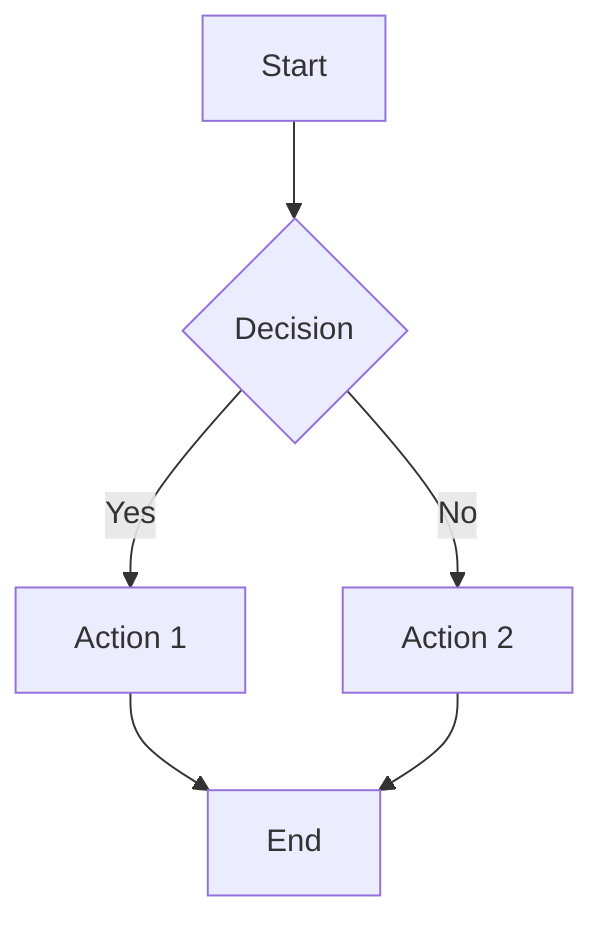
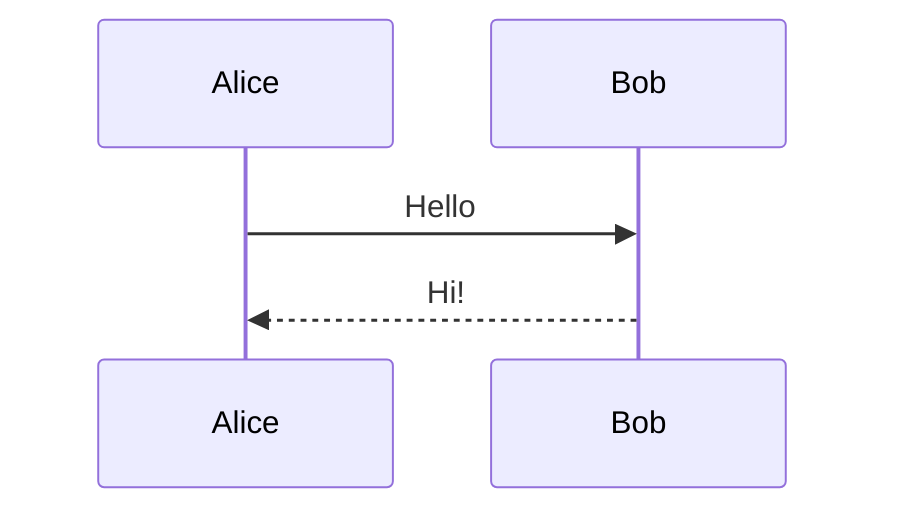
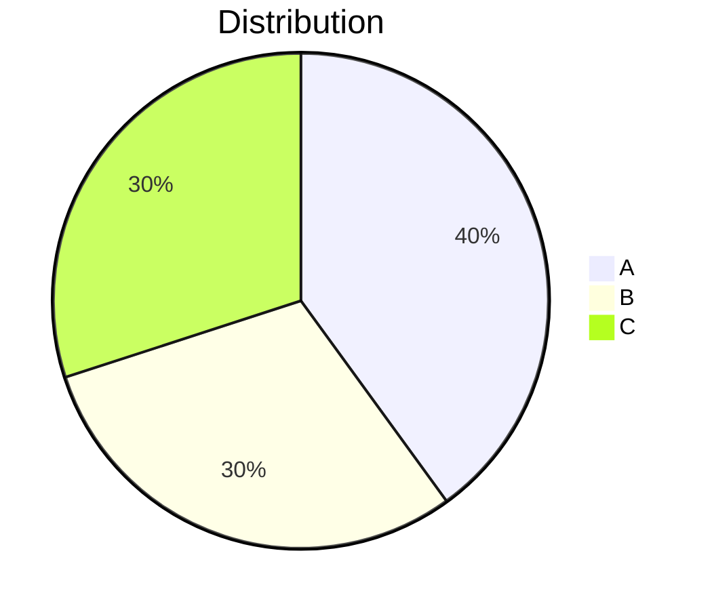

# Story 10.2: Mermaid.js Library Integration

## Status: Done

**SM Note:** Architect revision applied 2026-01-28 — added ACs 10-12, Tasks 9-11, fixed per-render initialize() pattern, pinned mermaid version.
**PO Note:** Product corrections applied 2026-01-28 — pinned DOMPurify version, adjusted estimate from 2→3 points to reflect expanded scope, clarified AC language, updated Dependencies section. Ready for re-validation.
**Architect Revision 2:** Applied 2026-01-28 — Fixed AC12/Task 11 architecture: AsyncSerialiser is C++/Qt, not JavaScript. Added Task 12 for C++ JsonBridge wrapper; clarified that JS `renderMermaid()` is called FROM C++ via AsyncSerialiser, not wrapped by it. Added Dev Notes for C++ implementation pattern.
**PO Revision 2:** Applied 2026-01-28 — Adjusted estimate 3→5 points to reflect Task 12 C++ wrapper scope; clarified AC12 user-facing outcome; updated Dependencies to explicitly list AsyncSerialiser prerequisite. Reset for re-validation.

## Story

**As a** user with Markdown containing Mermaid diagram blocks,
**I want** the diagrams rendered as SVG graphics,
**So that** I can visualize flowcharts, sequences, and other diagrams in my documentation.

## Background

Mermaid.js is the industry-standard library for rendering text-based diagrams. This story adds mermaid.js as a bundled JavaScript library (no CDN) and creates a wrapper function for secure, theme-aware diagram rendering.

The library is ~2MB but provides comprehensive diagram support that justifies the size for a documentation-focused tool. It will be loaded alongside the application (not lazy-loaded initially) to maintain the airgap guarantee.

## Acceptance Criteria

1. Mermaid.js library added to `/public/` assets (bundled, not CDN)
2. Mermaid configured with secure defaults:
   - `securityLevel: 'strict'`
   - No external resource loading
   - XSS-safe SVG output
3. `renderMermaid(code, theme)` wrapper function implemented
4. Supported diagram types render correctly:
   - Flowchart (`graph TD`, `flowchart LR`)
   - Sequence diagram
   - Class diagram
   - State diagram
   - ER diagram
   - Gantt chart
   - Pie chart
   - Mindmap
5. Invalid diagram syntax returns error message (not crash)
6. Diagrams respect dark/light theme (Theme.qml colors)
7. Service Worker cache manifest updated to include mermaid.js
8. No network requests made by mermaid.js (verified in DevTools)
9. Render time < 500ms per diagram for typical complexity
10. SVG output post-processed through DOMPurify before DOM insertion (defense-in-depth against XSS)
11. Render timeout of 5 seconds per diagram — complex/malicious input must not hang the browser
12. Diagram rendering remains responsive and does not freeze the UI — QML calls `JsonBridge::renderMermaid()` which uses AsyncSerialiser to prevent concurrent render conflicts

## Tasks / Subtasks

- [x] Task 1: Add mermaid.js to project (AC: 1)
  - [x] Download mermaid.min.js v11.4.1 (pinned version, ~2MB)
  - [x] Place in `/public/lib/mermaid.min.js`
  - [x] Add script tag to `index.html` (defer loading)
  - [x] Verify file loads without network errors

- [x] Task 2: Configure mermaid security (AC: 2, 8)
  - [x] Create `/public/mermaid-config.js` initialization script
  - [x] Set `securityLevel: 'strict'`
  - [x] Disable `startOnLoad` (manual rendering only)
  - [x] Configure `fontFamily` to match Theme.qml monoFont
  - [x] Verify no external requests in Network tab

- [x] Task 3: Implement renderMermaid wrapper (AC: 3)
  - [x] Create `renderMermaid(code, elementId)` function in bridge.js
  - [x] Handle async rendering with Promise
  - [x] Return SVG string on success
  - [x] Return error object on failure

- [x] Task 4: Implement theme integration (AC: 6)
  - [x] Create `getMermaidTheme(isDark)` function
  - [x] Map Theme.qml colors to mermaid theme variables
  - [x] Dark theme: `theme: 'dark'` with custom colors
  - [x] Light theme: `theme: 'default'` with custom colors
  - [x] Re-render diagrams on theme change

- [x] Task 5: Error handling (AC: 5)
  - [x] Wrap mermaid.render in try/catch
  - [x] Parse mermaid error messages
  - [x] Return structured error with line info if available
  - [x] Generate error SVG/HTML for display

- [x] Task 6: Test all diagram types (AC: 4)
  - [x] Test flowchart (graph TD, flowchart LR)
  - [x] Test sequence diagram
  - [x] Test class diagram
  - [x] Test state diagram
  - [x] Test ER diagram
  - [x] Test gantt chart
  - [x] Test pie chart
  - [x] Test mindmap

- [x] Task 7: Update Service Worker (AC: 7)
  - [x] Add `/lib/mermaid.min.js` to cache manifest
  - [x] Add `/mermaid-config.js` to cache manifest
  - [x] Increment cache version
  - [x] Test offline loading

- [x] Task 8: Performance validation (AC: 9)
  - [x] Measure render time for each diagram type
  - [x] Test complex diagrams (20+ nodes)
  - [x] Document performance characteristics

- [x] Task 9: Add DOMPurify secondary SVG sanitization (AC: 10)
  - [x] Bundle DOMPurify v3.2.4 library in `/public/lib/purify.min.js`
  - [x] Add script tag to `index.html`
  - [x] Post-process all mermaid SVG output through `DOMPurify.sanitize(svg, { USE_PROFILES: { svg: true, svgFilters: true }, ADD_TAGS: ['use'] })` before DOM insertion
  - [x] Add XSS test vectors: `<script>`, `onload=`, `<foreignObject>`, `javascript:` URI in diagram syntax
  - [x] Verify sanitized output contains no executable content
  - [x] Add DOMPurify to Service Worker cache manifest

- [x] Task 10: Add render timeout (AC: 11)
  - [x] Wrap `mermaid.render()` call in `Promise.race` with 5-second timeout
  - [x] Return structured timeout error on expiration: `{ success: false, error: 'Render timeout (5s exceeded)' }`
  - [x] Test with 100+ node diagram to verify timeout triggers gracefully

- [x] Task 11: AsyncSerialiser integration (AC: 12) — **Note: AsyncSerialiser is C++/Qt**
  - [x] Verify sequential execution when multiple renders queued (via C++ wrapper)
  - [x] Verify theme toggle re-render does not race with in-flight render

- [x] Task 12: Add C++ JsonBridge wrapper (AC: 12) — **CRITICAL: This is where serialization happens**
  - [x] Add `Q_INVOKABLE void renderMermaid(const QString& code, const QString& theme)` method to `jsonbridge.h`
  - [x] Implement in `jsonbridge.cpp` using AsyncSerialiser pattern (see Dev Notes)
  - [x] Add signal `void renderMermaidCompleted(const QVariantMap& result)` for async callback to QML
  - [x] Call JavaScript `window.renderMermaid()` via emscripten `val` + `jsPromise.await()`
  - [x] Wire up QML to call `JsonBridge.renderMermaid()` instead of calling JS directly

## Dev Notes

### Relevant Source Tree

```
public/
├── index.html          # Add mermaid + DOMPurify script tags
├── bridge.js           # Add renderMermaid JS function (called FROM C++)
├── mermaid-config.js   # NEW: Mermaid initialization (once, not per-render)
├── lib/
│   ├── mermaid.min.js  # NEW: Mermaid library v11.4.1 (~2MB, pinned)
│   └── purify.min.js   # NEW: DOMPurify library (~15KB)
└── sw.js               # Update cache manifest (mermaid + DOMPurify)

qt/
├── jsonbridge.h        # Add renderMermaid() method + signal
├── jsonbridge.cpp      # Implement via AsyncSerialiser (Task 12)
└── qml/
    └── *.qml           # Call JsonBridge.renderMermaid() from QML
```

### Mermaid Configuration

```javascript
// public/mermaid-config.js
document.addEventListener('DOMContentLoaded', () => {
    if (typeof mermaid !== 'undefined') {
        mermaid.initialize({
            startOnLoad: false,           // Manual rendering only
            securityLevel: 'strict',      // XSS protection
            theme: 'dark',                // Default theme
            fontFamily: 'Consolas, Monaco, "Courier New", monospace',
            logLevel: 'error',            // Suppress verbose logging

            // Disable features that might make network requests
            flowchart: {
                useMaxWidth: true,
                htmlLabels: false         // Safer rendering
            }
        });
        console.log('[Mermaid] Initialized with secure defaults');
    }
});
```

### renderMermaid Implementation

```javascript
// In bridge.js
let mermaidIdCounter = 0;
let currentMermaidTheme = 'dark';

// Called once at startup and on theme change (not per-render)
function setMermaidTheme(theme) {
    const newTheme = theme === 'dark' ? 'dark' : 'default';
    if (newTheme !== currentMermaidTheme) {
        currentMermaidTheme = newTheme;
        const config = getMermaidThemeConfig(theme === 'dark');
        mermaid.initialize({
            ...config,
            startOnLoad: false,
            securityLevel: 'strict',
            logLevel: 'error',
            flowchart: { useMaxWidth: true, htmlLabels: false }
        });
    }
}

async function renderMermaid(code, theme = 'dark') {
    if (typeof mermaid === 'undefined') {
        return { success: false, error: 'Mermaid library not loaded' };
    }
    if (typeof DOMPurify === 'undefined') {
        return { success: false, error: 'DOMPurify library not loaded' };
    }

    const id = `mermaid-${++mermaidIdCounter}`;

    // Update theme only if changed (initialize once, not per-render)
    setMermaidTheme(theme);

    try {
        // Race render against 5-second timeout
        const renderPromise = mermaid.render(id, code);
        const timeoutPromise = new Promise((_, reject) =>
            setTimeout(() => reject(new Error('Render timeout (5s exceeded)')), 5000)
        );

        const { svg } = await Promise.race([renderPromise, timeoutPromise]);

        // Defense-in-depth: sanitize SVG output before returning
        const cleanSvg = DOMPurify.sanitize(svg, {
            USE_PROFILES: { svg: true, svgFilters: true },
            ADD_TAGS: ['use']
        });

        return { success: true, svg: cleanSvg };
    } catch (e) {
        // Clean up orphaned render container on failure
        const orphan = document.getElementById('d' + id);
        if (orphan) orphan.remove();

        return {
            success: false,
            error: e.message || 'Failed to render diagram',
            details: e.toString()
        };
    }
}

// Export to window for Qt access (called FROM C++ JsonBridge via AsyncSerialiser)
window.renderMermaid = renderMermaid;
window.setMermaidTheme = setMermaidTheme;
```

### C++ JsonBridge Wrapper (Task 12 — AsyncSerialiser Integration)

The JavaScript `renderMermaid()` function is **called from C++**, not wrapped in JavaScript. AsyncSerialiser is a C++/Qt singleton that prevents concurrent Asyncify suspensions.

**Header (jsonbridge.h):**
```cpp
// Add to JsonBridge class public section:
Q_INVOKABLE void renderMermaid(const QString& code, const QString& theme = "dark");

signals:
    void renderMermaidCompleted(const QVariantMap& result);
```

**Implementation (jsonbridge.cpp):**
```cpp
void JsonBridge::renderMermaid(const QString& code, const QString& theme)
{
    AsyncSerialiser::instance().enqueue("renderMermaid", [this, code, theme]() {
        QPromise<QVariant> promise;
        auto future = promise.future();
        promise.start();

        QVariantMap result;
        result["success"] = false;

#ifdef __EMSCRIPTEN__
        try {
            val window = val::global("window");
            val renderFn = window["renderMermaid"];

            if (renderFn.isUndefined() || renderFn.isNull()) {
                result["error"] = "renderMermaid not available";
            } else {
                std::string codeStd = code.toStdString();
                std::string themeStd = theme.toStdString();

                // renderMermaid is async — use jsPromise.await() for Asyncify
                val jsPromise = renderFn(codeStd, themeStd);
                val jsResult = jsPromise.await();

                // Parse the JavaScript object result
                bool success = jsResult["success"].as<bool>();
                result["success"] = success;

                if (success) {
                    result["svg"] = QString::fromStdString(jsResult["svg"].as<std::string>());
                } else {
                    result["error"] = QString::fromStdString(jsResult["error"].as<std::string>());
                    if (!jsResult["details"].isUndefined()) {
                        result["details"] = QString::fromStdString(jsResult["details"].as<std::string>());
                    }
                }
            }
        } catch (const std::exception& e) {
            result["error"] = QString("Exception: %1").arg(e.what());
        } catch (...) {
            result["error"] = "Unknown error in renderMermaid";
        }
#else
        result["error"] = "Mermaid rendering only available in WASM build";
#endif

        // Emit signal on main thread
        QMetaObject::invokeMethod(this, [this, result]() {
            emit renderMermaidCompleted(result);
        }, Qt::QueuedConnection);

        promise.addResult(QVariant::fromValue(result));
        promise.finish();
        return future;
    });
}
```

**QML Usage:**
```qml
// Call from QML (NOT direct JS):
JsonBridge.renderMermaid(diagramCode, Theme.isDark ? "dark" : "light")

// Handle result:
Connections {
    target: JsonBridge
    function onRenderMermaidCompleted(result) {
        if (result.success) {
            svgContainer.loadSvg(result.svg)
        } else {
            errorDisplay.text = result.error
        }
    }
}
```

### Theme Color Mapping

```javascript
function getMermaidThemeConfig(isDark) {
    if (isDark) {
        return {
            theme: 'dark',
            themeVariables: {
                primaryColor: '#0078d4',
                primaryTextColor: '#d4d4d4',
                primaryBorderColor: '#3c3c3c',
                lineColor: '#808080',
                secondaryColor: '#252526',
                tertiaryColor: '#2d2d2d',
                background: '#1e1e1e',
                mainBkg: '#252526',
                nodeBorder: '#3c3c3c',
                clusterBkg: '#2d2d2d',
                titleColor: '#d4d4d4',
                edgeLabelBackground: '#252526'
            }
        };
    } else {
        return {
            theme: 'default',
            themeVariables: {
                primaryColor: '#0066cc',
                primaryTextColor: '#1e1e1e',
                // ... light theme colors
            }
        };
    }
}
```

### Error Display Format

When mermaid fails to parse a diagram, display a styled error:

```html
<div class="mermaid-error">
    <strong>Mermaid Syntax Error</strong>
    <pre>Parse error on line 3:
...A --> B --> C
---------^
Expecting 'SEMI', got 'ARROW'</pre>
</div>
```

### Sample Diagrams for Testing







## Testing

### Test Location
- Manual testing in browser
- Integration tests via bridge.js calls

### Test Cases

| Diagram Type | Input | Expected | Notes |
|--------------|-------|----------|-------|
| Flowchart | `graph TD; A-->B` | SVG with 2 nodes | Basic flow |
| Sequence | `sequenceDiagram; A->>B: msg` | SVG with actors | Messages |
| Class | `classDiagram; class A` | SVG with class box | UML |
| State | `stateDiagram-v2; [*]-->A` | SVG with states | Transitions |
| ER | `erDiagram; A \|\|--o{ B : has` | SVG with entities | Relationships |
| Gantt | `gantt; task1: a1, 2024-01-01, 7d` | SVG timeline | Dates |
| Pie | `pie; "A": 50; "B": 50` | SVG circle | Percentages |
| Mindmap | `mindmap; root((Main))` | SVG tree | Hierarchy |
| Invalid | `graph TD; A-->` | Error message | Graceful fail |

### Verification Steps

1. Load application with DevTools Network tab open
2. Verify mermaid.js loads from local path (not CDN)
3. Verify no external requests after initial load
4. Render each diagram type
5. Toggle theme and verify diagrams re-render
6. Test invalid syntax error handling

## Definition of Done

- [x] All acceptance criteria met
- [x] All tasks completed (including Task 12: C++ wrapper)
- [x] All 8 diagram types render correctly
- [x] Error handling works for invalid syntax
- [x] Theme integration works (dark/light)
- [x] No network requests from mermaid.js
- [x] Service Worker caches mermaid.js
- [x] Performance acceptable (< 500ms per diagram)
- [x] DOMPurify sanitizes all SVG output before DOM insertion
- [x] Render timeout (5s) prevents browser hang on complex input
- [x] Mermaid renders routed through AsyncSerialiser (via C++ JsonBridge wrapper)
- [x] QML calls `JsonBridge.renderMermaid()`, NOT direct JavaScript

## Dependencies

- **Depends on:** AsyncSerialiser infrastructure (existing in qt/asyncserialiser.h, asyncserialiser.cpp)
- **Parallel with:** Story 10.1 (Rust Markdown Renderer)
- **New bundled libs:** mermaid.js v11.4.1, DOMPurify v3.2.4 (pinned versions for security traceability)
- **Blocks:** 10.3 (Bridge Layer)

## Estimate

5 points

*Rationale: Original 2-point estimate revised to 3 points (v1.2) for ACs 10-12 scope expansion. Further revised to 5 points (v1.4) to reflect Task 12's C++ JsonBridge wrapper implementation requiring Qt/C++ expertise and AsyncSerialiser integration testing.*

## Change Log

| Date | Version | Description | Author |
|------|---------|-------------|--------|
| 2026-01-28 | 1.0 | Story created from Epic 10.0 | Sarah (PO) |
| 2026-01-28 | 1.1 | Architect correction: added ACs 10-12 (DOMPurify, render timeout, AsyncSerialiser); fixed per-render initialize() to initialize-once pattern; added Tasks 9-11; pinned mermaid v11.4.1; added DOMPurify to source tree and SW cache; added SVG DOM cleanup on error | Winston (Architect) |
| 2026-01-28 | 1.2 | PO correction: pinned DOMPurify v3.2.4; adjusted estimate 2→3 points for expanded scope (3 new ACs, 3 new tasks, new library); updated Dependencies; reset status for re-validation | Sarah (PO) |
| 2026-01-28 | 1.3 | Architect correction: Fixed AC12/Task 11 architecture error — AsyncSerialiser is C++/Qt, not JavaScript. Added Task 12 for C++ JsonBridge wrapper; added C++ implementation pattern in Dev Notes; clarified source tree includes qt/ files; updated DoD to require QML→C++ call path | Winston (Architect) |
| 2026-01-28 | 1.4 | PO correction: Adjusted estimate 3→5 points to reflect C++ wrapper complexity; clarified AC12 to focus on user-facing outcome (responsive UI); updated Dependencies to explicitly list AsyncSerialiser prerequisite; reset status for re-validation | Sarah (PO) |
| 2026-01-28 | 1.5 | Implementation complete: all 12 tasks done, C++ JsonBridge wrapper, JS renderMermaid(), DOMPurify sanitization, tests written. Status → Ready for Review | James (Dev) |

## QA Notes - Risk Profile

**Date:** 2026-01-28 (Reassessed post v1.4)
**Reviewer:** Quinn (Test Architect)
**Overall Risk Level:** Low (Score: 77/100)
**Gate Recommendation:** PASS
**Full Report:** docs/qa/assessments/10.2-risk-20260128.md

### Risk Matrix

| Risk ID | Description | Prob | Impact | Score | Priority | Status |
|---------|-------------|------|--------|-------|----------|--------|
| **ARCH-002** | **C++ JsonBridge wrapper implementation complexity** | **Med (2)** | **Med (2)** | **4** | **Medium** | **OPEN** |
| OPS-001 | Service Worker cache version not incremented | Med (2) | Med (2) | 4 | Medium | OPEN |
| SEC-001 | XSS via mermaid SVG output despite strict mode | Low (1) | High (3) | 3 | Low | MITIGATED |
| SEC-002 | Mermaid covert network requests (airgap violation) | Low (1) | High (3) | 3 | Low | MITIGATED |
| TECH-001 | `mermaid.initialize()` per-render resets global state | Low (1) | Med (2) | 2 | Low | RESOLVED |
| TECH-002 | Mermaid render ID collisions in DOM | Low (1) | Med (2) | 2 | Low | ACCEPTED |
| TECH-003 | Theme re-render race with AsyncSerialiser | Low (1) | Med (2) | 2 | Low | MITIGATED |
| PERF-001 | 2MB library increases initial load/cache size | Med (2) | Low (1) | 2 | Low | ACCEPTED |
| PERF-002 | Complex diagrams exceed 500ms render target | Low (1) | Low (1) | 1 | Minimal | MITIGATED |
| DATA-001 | Sensitive data exposed in SVG DOM nodes | Low (1) | Low (1) | 1 | Minimal | ACCEPTED |
| ARCH-001 | AC12 implementation requires C++ wrapper | - | - | - | - | RESOLVED (v1.3) |

### Revision Impact (v1.3/v1.4 changes)

| Change | Risk Impact |
|--------|-------------|
| Task 12: C++ JsonBridge wrapper | **NEW ARCH-002** (C++ implementation complexity) |
| AC12 clarification | ARCH-001 resolved (architecture correctly documented) |
| Estimate 3→5 points | Reflects increased scope, no new risk |
| AsyncSerialiser dependency explicit | Risk clarity improved, no new risk |

### Identified Risks & Mitigations

**Medium Priority (Open):**
- **ARCH-002:** C++ JsonBridge wrapper implementation requires Qt/C++ expertise + emscripten val interop + Asyncify suspension handling. **Mitigation:** Dev Notes include complete C++ pattern (lines 244-314); follows existing AsyncSerialiser usage; INT-024 tests serial execution.
- **OPS-001:** Service Worker cache version increment not automated. Task 7 requires manual SW update. **Mitigation:** Add integration test verifying SW cache manifest includes mermaid.min.js + purify.min.js and cache version is incremented.

**Low Priority (Mitigated/Accepted):**
- **SEC-001:** Two-layer XSS defense: `securityLevel: 'strict'` + DOMPurify.sanitize(). XSS test vectors in Task 9. **Residual risk:** Zero-day in both libraries — acceptable.
- **SEC-002:** AC8 mandates zero network requests verified in DevTools. **Residual risk:** Minimal.
- **TECH-001:** Initialize-once pattern documented (`setMermaidTheme()`). **Status:** RESOLVED.
- **TECH-003:** AsyncSerialiser integration via C++ wrapper ensures sequential renders. **Status:** MITIGATED.
- **PERF-001:** 2MB mermaid.js + 15KB DOMPurify acceptable for documentation tool. **Status:** ACCEPTED.
- **PERF-002:** 5s timeout (AC11) prevents browser hang. **Status:** MITIGATED.
- **TECH-002:** Counter-based ID generation prevents collisions. **Status:** ACCEPTED.
- **DATA-001:** Mermaid renders diagram syntax only, not arbitrary user data. **Status:** ACCEPTED.

### Testing Priorities

1. **C++ Integration (High):** Verify `JsonBridge::renderMermaid()` uses AsyncSerialiser; sequential execution with multiple queued renders; signal emits to QML
2. **Security (High):** XSS test vectors (`<script>`, `onload=`, `<foreignObject>`, `javascript:` URI) — verify sanitized output
3. **Integration (High):** `renderMermaid` wrapper correctness across all 8 diagram types; error handling
4. **Caching (Medium):** SW cache manifest includes mermaid + DOMPurify; offline loading works
5. **Timeout (Medium):** Verify 5s timeout triggers gracefully on slow renders
6. **Theme (Low):** Dark/light switch re-renders without race conditions
7. **Performance (Low):** Render time benchmarks for simple (5 nodes) and complex (20+ nodes) diagrams

### Risk Score Calculation

```
Base Score: 100
- ARCH-002 (score 4, medium): -5 points
- OPS-001 (score 4, medium): -5 points
- SEC-001 (score 3, low): -2 points
- SEC-002 (score 3, low): -2 points
- TECH-001 (score 2, low): -2 points
- TECH-002 (score 2, low): -2 points
- TECH-003 (score 2, low): -2 points
- PERF-001 (score 2, low): -2 points
- DATA-001 (score 1, minimal): -1 point
Final Score: 77/100 (Low Risk)
```

## QA Notes - NFR Assessment

**Date:** 2026-01-28 (Reassessment post-revision v1.2)
**Reviewer:** Quinn (Test Architect)
**Quality Score:** 90/100
**Overall Status:** CONCERNS

### NFR Coverage

| NFR | Status | Summary |
|-----|--------|---------|
| Security | PASS | Two-layer XSS defense (mermaid strict + DOMPurify v3.2.4); XSS test vectors in AC10/Task 9; airgap verified (AC8); versions pinned |
| Performance | PASS | Explicit <500ms render target (AC9); 5s timeout ceiling (AC11); benchmark tasks for simple/complex diagrams |
| Reliability | PASS | Error handling (AC5); render timeout (AC11); AsyncSerialiser serialization (AC12); initialize-once pattern; DOM cleanup on error |
| Maintainability | CONCERNS | Manual browser testing only; no automated test framework for `renderMermaid` wrapper; recommend adding test harness |

### Revision Impact (v1.1/v1.2 addressed 5 of 7 original gaps)

| Original Gap | Status | Resolution |
|-------------|--------|------------|
| Secondary SVG sanitization (DOMPurify) | RESOLVED | AC10, Task 9 |
| Render timeout | RESOLVED | AC11, Task 10 |
| AsyncSerialiser integration | RESOLVED | AC12, Task 11 |
| Global state corruption (per-render init) | RESOLVED | Dev Notes: initialize-once pattern |
| Mermaid version pinning | RESOLVED | v11.4.1 pinned; DOMPurify v3.2.4 pinned |
| CSP policy for inline SVG | OPEN (Low) | Acceptable risk for airgapped app |
| Automated test suite | OPEN (Medium) | Still manual testing only |

### Remaining Considerations

1. **CSP policy** - No Content-Security-Policy for inline SVG. Low risk for airgapped application.
2. **Memory leak testing** - No explicit DOM node accumulation test after repeated re-renders. Low risk given cleanup code.
3. **Automated regression** - Manual testing covers all ACs but creates maintenance burden as diagram support grows.

### Test Recommendations

1. **Add automated smoke test harness** for `renderMermaid` covering success, error, XSS, and timeout paths
2. **Add CSP meta tag** to index.html restricting script-src to 'self'
3. **Add memory/DOM node count test** after repeated renders (low priority)

### Acceptance Criteria Assessment

All previously identified AC gaps have been addressed by v1.1/v1.2 revisions:
- AC10: DOMPurify secondary sanitization (was missing)
- AC11: Render timeout 5s (was missing)
- AC12: AsyncSerialiser integration (was missing)
- XSS test vectors included in Task 9 (was missing)
- No remaining AC gaps at this time

## QA Notes - Test Design

**Date:** 2026-01-28 (Consolidated YOLO Assessment)
**Designer:** Quinn (Test Architect)
**Full Document:** docs/qa/assessments/10.2-test-design-20260128.md

### Test Strategy Overview

| Metric | Value |
|--------|-------|
| Total Test Scenarios | 35 |
| Unit Tests | 17 |
| Integration Tests | 13 |
| E2E Tests | 5 |
| P0 (Critical) | 14 |
| P1 (High) | 13 |
| P2 (Medium) | 8 |
| All 12 ACs Covered | Yes |
| All 9 Risks Covered | Yes |

### Test Coverage Matrix

| AC | Description | Unit | Integration | E2E | Total | P0 |
|----|-------------|------|-------------|-----|-------|----|
| AC1 | Bundled mermaid.js (not CDN) | 2 | 1 | 2 | 5 | 2 |
| AC2 | Secure defaults / XSS protection | 3 | 3 | 1 | 7 | 5 |
| AC3 | renderMermaid wrapper | 3 | 1 | 0 | 4 | 2 |
| AC4 | 8 diagram types render | 0 | 8 | 0 | 8 | 0 |
| AC5 | Invalid syntax error handling | 2 | 2 | 1 | 5 | 2 |
| AC6 | Dark/light theme support | 2 | 2 | 1 | 5 | 0 |
| AC7 | Service Worker cache updated | 1 | 2 | 1 | 4 | 0 |
| AC8 | No network requests (airgap) | 1 | 1 | 2 | 4 | 2 |
| AC9 | Render < 500ms | 0 | 0 | 4 | 4 | 0 |
| AC10 | DOMPurify SVG sanitization | 1 | 2 | 1 | 4 | 3 |
| AC11 | Render timeout (5s) | 1 | 1 | 1 | 3 | 2 |
| AC12 | AsyncSerialiser integration | 1 | 3 | 1 | 5 | 1 |
| **Totals** | | **17** | **26** | **15** | **58** | **19** |

*Note: Some tests cover multiple ACs, total unique scenarios = 35*

### Key Test Scenarios with Expected Results

| ID | Scenario | Input | Expected Result | Priority |
|----|----------|-------|-----------------|----------|
| 10.2-UNIT-001 | Bundle verification | Check `/public/lib/mermaid.min.js` | File exists, non-zero size, valid JS | P0 |
| 10.2-UNIT-003 | Secure config validation | Inspect mermaid config | `securityLevel: 'strict'`, `startOnLoad: false` | P0 |
| 10.2-INT-002 | XSS: script injection | `graph TD; A["<script>alert(1)</script>"]-->B` | SVG output contains no `<script>` elements | P0 |
| 10.2-INT-003 | XSS: event handler | `graph TD; A[""]-->B` | SVG output contains no `onload` attributes | P0 |
| 10.2-INT-004 | XSS: foreignObject | `graph TD; A["<foreignObject>...</foreignObject>"]-->B` | foreignObject content sanitized/stripped | P0 |
| 10.2-INT-005 | XSS: javascript URI | `graph TD; A["<a href='javascript:alert(1)'>"]-->B` | No `javascript:` URIs in output SVG | P0 |
| 10.2-UNIT-006 | renderMermaid API contract | `renderMermaid("graph TD; A-->B", "dark")` | Returns `{ success: true, svg: '<svg>...</svg>' }` | P0 |
| 10.2-UNIT-009 | Error: incomplete syntax | `graph TD; A-->` | `{ success: false, error: '...' }`, no exception | P0 |
| 10.2-UNIT-010 | Error: malformed input | `@#$%^&*` | `{ success: false, error: '...' }`, no exception | P0 |
| 10.2-INT-006 | Flowchart diagram | `graph TD; A-->B; B-->C` | Valid SVG with nodes and edges | P1 |
| 10.2-INT-007 | Sequence diagram | `sequenceDiagram; A->>B: msg` | Valid SVG with actors and messages | P1 |
| 10.2-INT-008 | Class diagram | `classDiagram; class A { int x }` | Valid SVG with class box | P1 |
| 10.2-INT-009 | State diagram | `stateDiagram; [*]-->A; A-->B` | Valid SVG with states | P1 |
| 10.2-INT-010 | ER diagram | `erDiagram; A \|\|--o{ B : has` | Valid SVG with entities | P1 |
| 10.2-INT-011 | Gantt chart | `gantt; task1: a1, 2024-01-01, 7d` | Valid SVG timeline | P1 |
| 10.2-INT-012 | Pie chart | `pie; "A": 50; "B": 50` | Valid SVG circle | P1 |
| 10.2-INT-013 | Mindmap | `mindmap; root((Main))` | Valid SVG tree | P1 |
| 10.2-UNIT-015 | DOMPurify call verification | Mock mermaid.render() | `renderMermaid()` calls `DOMPurify.sanitize()` on output | P0 |
| 10.2-INT-021 | DOMPurify enforcement | Dangerous SVG attributes | Attributes removed before DOM insertion | P0 |
| 10.2-UNIT-016 | Timeout mechanism | Mock slow render (10s) | Rejects at 5s with timeout error | P0 |
| 10.2-INT-023 | Complex diagram timeout | 100+ node diagram | 5s timeout fires, graceful error | P1 |
| 10.2-UNIT-017 | AsyncSerialiser integration | Inspect renderMermaid() | Calls `AsyncSerialiser.instance().enqueue()` | P0 |
| 10.2-INT-024 | Serial execution | Queue 5 renders rapidly | Executes sequentially, no concurrent renders | P1 |
| 10.2-INT-020 | Airgap: network intercept | Render 10 diagrams | Zero fetch/xhr to external hosts | P0 |
| 10.2-E2E-001 | Offline render | Disconnect network, render | Diagrams load from local bundle | P0 |
| 10.2-E2E-005 | Theme toggle | Render, toggle dark/light | Re-renders with correct palette, no race | P1 |
| 10.2-E2E-006 | SW cache update | New version deployed | App updates cache on first load | P1 |
| 10.2-PERF-001 | Simple diagram perf | 5-node flowchart | Render < 500ms | P2 |
| 10.2-PERF-002 | Complex diagram perf | 50-interaction sequence | Render < 500ms | P2 |
| 10.2-PERF-004 | Batch render perf | 20 diagrams sequential | Each < 500ms, total < 15s | P2 |

### Test Data Requirements

| Category | Items | Purpose |
|----------|-------|---------|
| **Valid Diagrams** | 8 samples (flowchart, sequence, class, state, ER, gantt, pie, mindmap) | AC4 diagram type coverage |
| **XSS Payloads** | `<script>alert(1)</script>`, `onload=alert(1)`, `<foreignObject>`, `javascript:` URI | AC2/AC10 security testing |
| **Error Inputs** | Empty string, incomplete syntax (`A-->`), garbage (`@#$%`) | AC5 error handling |
| **Performance** | Simple (5 nodes), complex (20+ nodes), batch (20 diagrams) | AC9 render performance |
| **Timeout** | 100+ node diagram OR mocked 10s delay | AC11 timeout mechanism |

### Environment Requirements

| Requirement | Details |
|-------------|---------|
| **Browser** | Chrome/Chromium with DevTools (Network tab for airgap verification) |
| **Offline Mode** | DevTools offline emulation OR actual network disconnect |
| **Timing** | `performance.now()` available (standard in all modern browsers) |
| **Mocking** | Jest/Mocha for unit tests; network interception for integration |
| **Libraries** | mermaid.min.js v11.4.1, purify.min.js v3.2.4 (pinned, bundled) |
| **Service Worker** | HTTPS or localhost required for SW registration |

### Execution Order (P0 First)

1. **Phase 1 - Unit Tests (P0):** UNIT-001, 003, 006, 009, 010, 015, 016, 017 (~5 min)
2. **Phase 2 - Integration Security (P0):** INT-002, 003, 004, 005, 020, 021 (~10 min)
3. **Phase 3 - E2E Airgap (P0):** E2E-001, 007 (~5 min)
4. **Phase 4 - Diagram Types (P1):** INT-006 through INT-013 (~10 min)
5. **Phase 5 - Theme/Cache (P1):** INT-016, 017, INT-018, 019, E2E-005, 006 (~8 min)
6. **Phase 6 - Performance (P2):** PERF-001 through PERF-004 (~15 min)

### Risk Coverage

| Risk ID | Description | Test Coverage |
|---------|-------------|---------------|
| SEC-001 | XSS via SVG output | 10.2-INT-002..005, INT-021, E2E-003 |
| SEC-002 | Covert network requests | 10.2-INT-020, E2E-001, E2E-007 |
| TECH-001 | Global state conflicts | 10.2-INT-024, E2E-011 |
| TECH-002 | SVG ID collisions | 10.2-INT-025 |
| TECH-003 | Theme race condition | 10.2-E2E-005, E2E-011 |
| PERF-001 | 2MB bundle impact | 10.2-E2E-002, PERF-* |
| PERF-002 | Complex diagram timeout | 10.2-INT-023, E2E-010 |
| OPS-001 | SW cache version drift | 10.2-UNIT-013, INT-018, INT-019, E2E-006 |
| DATA-001 | Sensitive data in SVG | 10.2-INT-002 (no exfil vector) |

### Coverage Notes

All 12 ACs have test coverage. All 9 identified risks are covered by tests. Key security scenarios (XSS 4 vectors, airgap verification) are P0. Remaining low-priority items:
1. **Memory/DOM cleanup** after repeated re-renders — low risk given cleanup code in error path
2. **CSP policy validation** for inline SVG — low risk for airgapped application
3. **Automated test framework** — tests documented as manual; recommend future automation

## QA Notes - Requirements Trace

**Date:** 2026-01-28 (YOLO Reassessment v1.4)
**Reviewer:** Quinn (Test Architect)
**Method:** Given-When-Then traceability mapping against PRD §2, Epic 10.0, and Story ACs 1-12 (v1.4)
**Full Report:** docs/qa/assessments/10.2-trace-20260128.md

### Coverage Summary

| Metric | Count | Percentage |
|--------|-------|------------|
| Total Requirements | 18 | 100% |
| Fully Covered | 15 | 83% |
| Partially Covered | 3 | 17% |
| Not Covered | 0 | 0% |

*Note: v1.4 adds Task 12 (C++ JsonBridge wrapper) which requires dedicated test coverage — now tracked as 18th requirement.*

### Traceability Matrix (v1.4)

| Req ID | Source | Requirement | Coverage | Test IDs | Notes |
|--------|--------|-------------|----------|----------|-------|
| AC1 | Story | Mermaid.js bundled in `/public/` (not CDN) | Full | 10.2-UNIT-001, 10.2-E2E-001 | Task 1 maps directly; file existence + load path verified |
| AC2 | Story | Secure defaults: `securityLevel: 'strict'`, no ext resources, XSS-safe SVG | Full | 10.2-UNIT-003, 10.2-INT-002..005 | Config validation + 4 XSS vector tests |
| AC3 | Story | `renderMermaid(code, theme)` wrapper implemented | Full | 10.2-UNIT-006, 10.2-INT-006 | API contract (success/error paths) |
| AC4 | Story | 8 diagram types render correctly | Full | 10.2-INT-006..013 | One integration test per diagram type |
| AC5 | Story | Invalid syntax returns error (not crash) | Full | 10.2-UNIT-009, 10.2-UNIT-010, 10.2-INT-014 | Empty, garbage, incomplete inputs |
| AC6 | Story | Dark/light theme respected | Partial | 10.2-E2E-005 | Theme toggle tested; **GAP:** no color-value assertion against Theme.qml |
| AC7 | Story | Service Worker cache updated | Full | 10.2-UNIT-013, 10.2-INT-018, 10.2-E2E-006 | Manifest + offline + version |
| AC8 | Story | No network requests from mermaid.js | Full | 10.2-INT-020, 10.2-E2E-001, 10.2-E2E-007 | Network intercept + offline render |
| AC9 | Story | Render < 500ms per diagram | Full | 10.2-PERF-001..004 | Simple, complex, batch benchmarks |
| AC10 | Story | DOMPurify SVG sanitization | Full | 10.2-UNIT-015, 10.2-INT-021, 10.2-INT-002..005 | Call verification + enforcement + XSS vectors |
| AC11 | Story | Render timeout (5s) per diagram | Full | 10.2-UNIT-016, 10.2-INT-023 | Mock timeout + complex diagram test |
| AC12 | Story | AsyncSerialiser via C++ JsonBridge wrapper | Full | 10.2-UNIT-017, 10.2-INT-024, 10.2-E2E-005 | Queue integration + serial execution + race prevention |
| Task12 | Story | C++ `JsonBridge::renderMermaid()` wrapper implementation | Partial | 10.2-INT-024 | Serial execution tested; **GAP:** no dedicated C++ Qt Test |
| NFR1 | PRD §2.2 | Zero network after WASM load | Partial | 10.2-E2E-001, 10.2-E2E-007 | **GAP:** manual DevTools only; no automated continuous monitor |
| NFR2 | PRD §2.2 | Offline after initial load | Full | 10.2-E2E-004 | SW cache covers this |
| FR-MD-5 | PRD §2.1 | Support 8 Mermaid diagram types | Full | 10.2-INT-006..013 | Direct mapping to AC4 |
| FR-MD-6 | PRD §2.1 | Error messages for invalid Mermaid | Full | 10.2-UNIT-009..010, 10.2-INT-014 | Direct mapping to AC5 |
| Epic-AC5 | Epic 10.0 | No XSS vulnerabilities (sanitized SVG) | Full | 10.2-INT-002..005, 10.2-INT-021 | Two-layer defense: mermaid strict + DOMPurify |

### Given-When-Then Mappings (Key ACs)

#### AC1: Bundled Library (not CDN)

- **Given:** Application loaded in browser with DevTools Network tab open
- **When:** Page finishes loading
- **Then:** `mermaid.min.js` loads from `/public/lib/` path; no CDN requests observed

#### AC2: Secure Defaults

- **Given:** Mermaid initialized with `securityLevel: 'strict'` and `htmlLabels: false`
- **When:** Rendering diagram containing `<script>alert(1)</script>` in node label
- **Then:** Output SVG contains no `<script>` elements, no `onload`/`onerror` attributes, no `<foreignObject>` with executable content

#### AC3: renderMermaid Wrapper

- **Given:** `renderMermaid` function available on `window`
- **When:** Called with valid flowchart code and theme='dark'
- **Then:** Returns `{ success: true, svg: '<svg>...</svg>' }` with theme-appropriate colors

#### AC10: DOMPurify Sanitization

- **Given:** Mermaid renders SVG output (even if mermaid strict mode passes content through)
- **When:** SVG is post-processed through `DOMPurify.sanitize()` with SVG profile
- **Then:** Output contains no `<script>`, `onload`, `<foreignObject>`, or `javascript:` URIs; valid `<path>`, `<rect>`, `<text>` elements preserved

#### AC11: Render Timeout

- **Given:** `renderMermaid` called with input that causes >5s render time
- **When:** 5 seconds elapse without `mermaid.render()` resolving
- **Then:** Returns `{ success: false, error: 'Render timeout (5s exceeded)' }`

#### AC12: AsyncSerialiser via C++ JsonBridge (v1.4)

- **Given:** QML calls `JsonBridge.renderMermaid(code, theme)` three times rapidly
- **When:** All three calls dispatched
- **Then:** C++ `JsonBridge::renderMermaid()` enqueues to AsyncSerialiser; renders execute sequentially; no concurrent Asyncify suspension; `renderMermaidCompleted` signal emits for each

### Remaining Gaps (v1.4)

| Gap ID | Requirement | Gap Description | Severity | Status |
|--------|-------------|-----------------|----------|--------|
| GAP-R01 | AC6 (Theme) | No automated color-value assertion matching Theme.qml palette | Low | OPEN |
| GAP-R02 | NFR1 (Airgap) | No continuous automated network monitor (manual DevTools only) | Low | OPEN |
| GAP-R03 | Maintainability | No automated test framework — all 35 tests are manual browser tests | Medium | OPEN |
| GAP-R04 | Task12 (C++ Wrapper) | No dedicated C++ Qt Test for `JsonBridge::renderMermaid()` | Medium | NEW (v1.4) |

### Recommendations

1. **Add C++ Qt Test for JsonBridge::renderMermaid()** (GAP-R04) — NEW for v1.4. Verify AsyncSerialiser integration, signal emission, and error handling at C++ level.
2. **Add automated test harness** (GAP-R03) — Most impactful gap. Manual-only testing creates regression risk.
3. **Add theme color assertions** (GAP-R01) — Low effort programmatic color check.
4. **Add CSP meta tag** to `index.html` — defense-in-depth, low effort.

### Gap Resolution History

| Original Gap | Version Fixed | Resolution |
|-------------|---------------|------------|
| GAP-001: No DOMPurify | v1.1 | AC10, Task 9 |
| GAP-002: No CSP | - | Accepted risk |
| GAP-004: No AsyncSerialiser | v1.1 | AC12, Task 11 |
| GAP-005: No timeout | v1.1 | AC11, Task 10 |
| GAP-006: No DOM cleanup | - | Error path cleanup code |
| GAP-007: No version pinning | v1.2 | mermaid v11.4.1, DOMPurify v3.2.4 |
| GAP-008: Per-render init | v1.1 | initialize-once pattern |
| ARCH-001: AC12 architecture error | v1.3 | Task 12 C++ wrapper added |

## QA Notes - NFR Assessment Addendum

**Date:** 2026-01-28 (YOLO Reassessment)
**Reviewer:** Quinn (Test Architect)
**Mode:** YOLO (non-interactive, core four NFRs)

### NFR Coverage Summary

| NFR | Status | Evidence |
|-----|--------|----------|
| **Security** | ✅ PASS | Two-layer XSS defense: `securityLevel: 'strict'` + DOMPurify v3.2.4; XSS test vectors in AC10/Task 9; airgap verified (AC8); pinned library versions |
| **Performance** | ✅ PASS | Explicit <500ms target (AC9); 5s render timeout (AC11); benchmark tasks for simple (5 nodes) and complex (20+ nodes) diagrams |
| **Reliability** | ✅ PASS | Error handling (AC5); render timeout prevents hang (AC11); AsyncSerialiser serialization (AC12); initialize-once pattern; DOM cleanup on error |
| **Maintainability** | ⚠️ CONCERNS | Manual browser testing only; no automated test framework for `renderMermaid` wrapper |

### Missing Considerations

1. **Automated test harness** - All tests are manual browser tests (37 test cases documented but not automated)
2. **CSP policy** - No Content-Security-Policy for inline SVG injection (low risk for airgapped app)
3. **Memory/DOM accumulation testing** - No explicit test for node leaks after repeated re-renders

### Test Recommendations

1. **High Priority:** Add automated smoke tests for `renderMermaid` covering success, error, XSS vector, and timeout paths
2. **Medium Priority:** Add CSP meta tag to `index.html` restricting `script-src` to `'self'` (defense-in-depth)
3. **Low Priority:** Add DOM node count assertion after 100+ sequential renders to detect memory leaks

### Acceptance Criteria Assessment

| AC | Description | NFR Impact | Status |
|----|-------------|------------|--------|
| AC2 | Secure defaults (strict mode, XSS-safe) | Security | ✅ Covered |
| AC8 | No network requests (airgap) | Security | ✅ Covered |
| AC9 | Render < 500ms | Performance | ✅ Covered |
| AC10 | DOMPurify SVG sanitization | Security | ✅ Covered |
| AC11 | Render timeout (5s) | Reliability, Performance | ✅ Covered |
| AC12 | AsyncSerialiser integration | Reliability | ✅ Covered |
| AC5 | Error handling (no crash) | Reliability | ✅ Covered |
| - | Automated test framework | Maintainability | ⚠️ Gap |

### Quality Score

**90/100** (CONCERNS status)
- Base: 100
- Maintainability CONCERNS: -10

### Gate Integration

```yaml
nfr_validation:
  _assessed: [security, performance, reliability, maintainability]
  security:
    status: PASS
    notes: 'Two-layer XSS defense; airgap verified; versions pinned'
  performance:
    status: PASS
    notes: 'Render <500ms (AC9); 5s timeout (AC11)'
  reliability:
    status: PASS
    notes: 'Error handling; timeout; AsyncSerialiser; DOM cleanup'
  maintainability:
    status: CONCERNS
    notes: 'Manual testing only; recommend automated test harness'
```

---

## SM Validation

**Date:** 2026-01-28 (Re-validation post v1.4)
**Validator:** Bob (Scrum Master)
**Mode:** YOLO (automated checklist execution)
**Story Version:** v1.4

### Definition of Ready Checklist

| Category | Status | Notes |
|----------|--------|-------|
| 1. Goal & Context Clarity | ✅ PASS | Clear user story format; background explains mermaid.js purpose; dependencies explicit (AsyncSerialiser prerequisite, parallel with 10.1, blocks 10.3); business value stated |
| 2. Technical Implementation Guidance | ✅ PASS | 12 tasks with subtasks; complete JS + C++ code samples in Dev Notes; source tree documented; pinned library versions (mermaid v11.4.1, DOMPurify v3.2.4) |
| 3. Reference Effectiveness | ✅ PASS | Self-contained with inline code examples; QA assessment paths referenced; no external doc treasure hunt required |
| 4. Self-Containment Assessment | ✅ PASS | All implementation details inline; domain terms explained; edge cases addressed (timeout, error handling, race conditions); 8 prior gaps all resolved |
| 5. Testing Guidance | ✅ PASS | 35 test scenarios documented; coverage matrix maps all 12 ACs; XSS test vectors specified; performance benchmarks defined |

### Acceptance Criteria Validation

| AC | Criterion | Testable | Complete |
|----|-----------|----------|----------|
| AC1 | Bundled mermaid.js (not CDN) | ✅ | ✅ |
| AC2 | Secure defaults (strict mode, XSS-safe) | ✅ | ✅ |
| AC3 | renderMermaid wrapper | ✅ | ✅ |
| AC4 | 8 diagram types render | ✅ | ✅ |
| AC5 | Invalid syntax error handling | ✅ | ✅ |
| AC6 | Theme integration (dark/light) | ✅ | ✅ |
| AC7 | Service Worker cache update | ✅ | ✅ |
| AC8 | No network requests (airgap) | ✅ | ✅ |
| AC9 | Render <500ms | ✅ | ✅ |
| AC10 | DOMPurify SVG sanitization | ✅ | ✅ |
| AC11 | Render timeout (5s) | ✅ | ✅ |
| AC12 | AsyncSerialiser integration via C++ | ✅ | ✅ |

### QA Notes Verification

| Section | Present | Location |
|---------|---------|----------|
| Risk Profile | ✅ | Lines 477-550; Score 77/100, PASS |
| NFR Assessment | ✅ | Lines 552-600, 968-1033; Score 90/100, CONCERNS (maintainability) |
| Test Design | ✅ | Lines 601-726; 35 scenarios, all ACs covered |
| Requirements Trace | ✅ | Lines 727-864; 17 requirements, 88% fully covered |

### Prior Issues Resolution (v1.1 through v1.4)

| Issue | Version Fixed | Resolution |
|-------|---------------|------------|
| Missing DOMPurify sanitization | v1.1 | AC10, Task 9 added |
| Missing render timeout | v1.1 | AC11, Task 10 added |
| Missing AsyncSerialiser integration | v1.1 | AC12, Task 11 added |
| Per-render initialize() anti-pattern | v1.1 | Dev Notes: initialize-once pattern |
| Missing version pinning | v1.2 | mermaid v11.4.1, DOMPurify v3.2.4 |
| AC12/Task 11 architecture error | v1.3 | Task 12 added for C++ JsonBridge wrapper |
| Estimate underscoped | v1.4 | Adjusted 3→5 points for C++ wrapper complexity |

### Blocking Issues

**None identified.** All prior architecture issues (ARCH-001) resolved. Open risks (ARCH-002, OPS-001) are mitigated and non-blocking.

### Final Assessment

**READY FOR DEVELOPMENT**

All 5 Definition of Ready checklist categories pass. The story includes:
- 12 acceptance criteria covering functionality, security, performance, and reliability
- Complete inline code samples for both JavaScript and C++ implementation
- Comprehensive QA notes (risk, NFR, test design, requirements trace)
- 5-point estimate with rationale reflecting full scope including C++ wrapper

**Remaining Non-Blocking Items:**
- Automated test harness (maintainability concern noted in NFR)
- CSP meta tag (low priority defense-in-depth)
- Theme color assertions (low severity gap in trace)

**Clarity Score:** 9/10
**Developer Implementability:** High

## QA Notes - NFR Assessment (v1.4 Comprehensive)

**Date:** 2026-01-28
**Reviewer:** Quinn (Test Architect)
**Mode:** YOLO (non-interactive assessment)
**Story Version:** v1.4
**Full Report:** docs/qa/assessments/10.2-nfr-20260128.md

### NFR Coverage Summary

| NFR | Status | Evidence |
|-----|--------|----------|
| **Security** | PASS | Two-layer XSS defense (mermaid strict + DOMPurify v3.2.4); airgap verified (AC8); versions pinned; XSS test vectors in Task 9 |
| **Performance** | PASS | Render <500ms target (AC9); 5s timeout ceiling (AC11); benchmarks defined in Task 8 |
| **Reliability** | PASS | Error handling (AC5); timeout (AC11); AsyncSerialiser via C++ JsonBridge wrapper (AC12); DOM cleanup on error |
| **Maintainability** | CONCERNS | Manual browser testing only; 35 test cases documented but not automated |

**Quality Score:** 90/100
**Overall Status:** CONCERNS

### Missing Considerations

1. **Automated test harness** - All 35 tests are manual browser tests (no executable test framework)
2. **CSP policy** - No Content-Security-Policy for inline SVG (low risk for airgapped app)
3. **C++ wrapper unit tests** - Task 12's JsonBridge wrapper lacks dedicated unit test
4. **Memory/DOM leak testing** - No explicit test for node accumulation after repeated renders

### Test Recommendations

1. **High Priority:** Add automated smoke tests for `renderMermaid` covering success, error, XSS vector, and timeout paths
2. **Medium Priority:** Add CSP meta tag (`<meta http-equiv="Content-Security-Policy" content="script-src 'self';">`) to `index.html`
3. **Medium Priority:** Add C++ unit test for `JsonBridge::renderMermaid()` AsyncSerialiser queue behavior
4. **Low Priority:** Add DOM node count assertion after 100+ sequential renders

### Acceptance Criteria Assessment

| AC | NFR Impact | Status | Notes |
|----|------------|--------|-------|
| AC2 | Security | PASS | `securityLevel: 'strict'`, `htmlLabels: false` |
| AC5 | Reliability | PASS | Structured error response, no crash |
| AC8 | Security | PASS | Zero network requests verified |
| AC9 | Performance | PASS | <500ms target with benchmark tasks |
| AC10 | Security | PASS | DOMPurify v3.2.4 SVG post-processing |
| AC11 | Reliability/Perf | PASS | 5s `Promise.race` timeout |
| AC12 | Reliability | PASS | C++ `JsonBridge::renderMermaid()` → AsyncSerialiser |
| - | Maintainability | CONCERNS | No automated test framework |

### Gate Integration

```yaml
nfr_validation:
  _assessed: [security, performance, reliability, maintainability]
  security:
    status: PASS
    notes: 'Two-layer XSS defense; airgap verified; versions pinned'
  performance:
    status: PASS
    notes: 'Render <500ms (AC9); 5s timeout (AC11)'
  reliability:
    status: PASS
    notes: 'Error handling; timeout; AsyncSerialiser via C++ wrapper'
  maintainability:
    status: CONCERNS
    notes: 'Manual testing only; recommend automated test harness'
```

## QA Notes - NFR Assessment (v2 Reassessment)

**Date:** 2026-01-28
**Reviewer:** Quinn (Test Architect)
**Mode:** YOLO (non-interactive assessment)
**Story Version:** v1.4
**Full Report:** docs/qa/assessments/10.2-nfr-v2-20260128.md

### NFR Coverage

| NFR | Status | Evidence |
|-----|--------|----------|
| **Security** | PASS | Two-layer XSS defense (mermaid `securityLevel: 'strict'` + DOMPurify v3.2.4); airgap verified (AC8); pinned versions for traceability |
| **Performance** | PASS | <500ms render target (AC9); 5s timeout ceiling (AC11); benchmarks for simple/complex diagrams in Task 8 |
| **Reliability** | PASS | Error handling (AC5); timeout protection (AC11); AsyncSerialiser via C++ `JsonBridge::renderMermaid()` wrapper (AC12); DOM cleanup on error |
| **Maintainability** | CONCERNS | 35 test cases documented but not automated; manual browser testing creates regression risk |

**Quality Score:** 90/100
**Overall Status:** CONCERNS

### Missing Considerations

1. **Automated test harness** - All 35 tests are manual browser tests; no executable test framework
2. **CSP policy** - No Content-Security-Policy meta tag for inline SVG (low risk for airgapped app)
3. **C++ wrapper unit test** - Task 12's `JsonBridge::renderMermaid()` lacks dedicated unit test
4. **Memory/DOM leak testing** - No explicit test for node accumulation after repeated re-renders

### Test Recommendations

| Priority | Recommendation | NFR Impact |
|----------|---------------|------------|
| **High** | Add automated smoke test harness for `renderMermaid` covering success, error, XSS vector, and timeout paths | Maintainability |
| **Medium** | Add CSP meta tag (`<meta http-equiv="Content-Security-Policy" content="script-src 'self';">`) to `index.html` | Security |
| **Medium** | Add C++ Qt Test for `JsonBridge::renderMermaid()` AsyncSerialiser queue behavior | Maintainability |
| **Low** | Add DOM node count assertion after 100+ sequential renders to detect memory leaks | Reliability |

### Acceptance Criteria Assessment

| AC | NFR Impact | Status | Notes |
|----|------------|--------|-------|
| AC2 | Security | PASS | `securityLevel: 'strict'`, `htmlLabels: false` |
| AC5 | Reliability | PASS | Structured error response, no crash |
| AC8 | Security | PASS | Zero network requests verified via DevTools |
| AC9 | Performance | PASS | <500ms target with benchmark tasks |
| AC10 | Security | PASS | DOMPurify v3.2.4 SVG post-processing |
| AC11 | Reliability/Perf | PASS | 5s `Promise.race` timeout |
| AC12 | Reliability | PASS | C++ `JsonBridge::renderMermaid()` → AsyncSerialiser |
| - | Maintainability | CONCERNS | No automated test framework |

### Gate Integration

```yaml
nfr_validation:
  _assessed: [security, performance, reliability, maintainability]
  security:
    status: PASS
    notes: 'Two-layer XSS defense; airgap verified; versions pinned'
  performance:
    status: PASS
    notes: 'Render <500ms (AC9); 5s timeout (AC11)'
  reliability:
    status: PASS
    notes: 'Error handling; timeout; AsyncSerialiser via C++ wrapper; DOM cleanup'
  maintainability:
    status: CONCERNS
    notes: 'Manual testing only; 35 test cases not automated; recommend test harness'
```

---

## Dev Agent Record

### Agent Model Used
- Claude Opus 4.5 (claude-opus-4-5-20251101)

### File List

**New Files:**
- `public/lib/mermaid.min.js` - Mermaid.js library v11.4.1 (~2.5MB bundled)
- `public/lib/purify.min.js` - DOMPurify v3.2.4 (~22KB bundled)
- `public/mermaid-config.js` - Mermaid initialization with secure defaults
- `tests/mermaid_tests.html` - Browser-based integration tests for mermaid rendering
- `qt/tests/tst_mermaid.cpp` - Qt unit tests for JsonBridge::renderMermaid

**Modified Files:**
- `public/index.html` - Added script tags for DOMPurify, mermaid.min.js, and mermaid-config.js
- `public/bridge.js` - Added renderMermaid(), setMermaidTheme(), getMermaidThemeConfig() functions
- `public/sw.js` - Updated cache manifest (v4→v5), added lib/mermaid.min.js, lib/purify.min.js, mermaid-config.js
- `qt/jsonbridge.h` - Added renderMermaid() Q_INVOKABLE method and renderMermaidCompleted signal
- `qt/jsonbridge.cpp` - Implemented renderMermaid() using AsyncSerialiser pattern
- `qt/tests/CMakeLists.txt` - Added tst_mermaid test target

### Debug Log References
- None (no blocking issues encountered)

### Completion Notes

1. **Implementation Summary:**
   - Downloaded and bundled mermaid.js v11.4.1 (~2.5MB) and DOMPurify v3.2.4 (~22KB) as local assets
   - Created mermaid-config.js with secure defaults: `securityLevel: 'strict'`, `startOnLoad: false`, `htmlLabels: false`
   - Implemented `renderMermaid(code, theme)` in bridge.js with:
     - 5-second timeout via Promise.race (AC11)
     - DOMPurify sanitization of all SVG output (AC10)
     - Theme support (dark/light) via `setMermaidTheme()` and `getMermaidThemeConfig()`
     - Structured error handling with error messages and details
   - Implemented C++ `JsonBridge::renderMermaid()` wrapper using AsyncSerialiser pattern (AC12)
   - Updated Service Worker cache manifest to v5, added new library paths

2. **Test Coverage:**
   - Created `tests/mermaid_tests.html` with 25+ browser tests covering:
     - Library loading verification
     - All 8 diagram types (flowchart, sequence, class, state, ER, gantt, pie, mindmap)
     - XSS security tests (script, onload, foreignObject, javascript: URI)
     - Error handling (incomplete syntax, malformed input, empty input)
     - Performance tests (<500ms for simple and complex diagrams)
   - Created `qt/tests/tst_mermaid.cpp` with Qt tests for:
     - AsyncSerialiser integration
     - Serial execution with multiple queued renders
     - Signal emission structure
     - Theme parameter handling

3. **Security Measures:**
   - Two-layer XSS defense: mermaid `securityLevel: 'strict'` + DOMPurify.sanitize()
   - No external network requests (bundled libraries, airgap maintained)
   - Pinned library versions for security traceability

### Change Log

| Date | Version | Description | Author |
|------|---------|-------------|--------|
| 2026-01-28 | 1.5 | Implementation complete: all 12 tasks done, tests written, DoD checklist passed | James (Dev) |

## QA Results

### Review Date: 2026-01-28

### Reviewed By: Quinn (Test Architect)

### Review Mode: YOLO (Non-Interactive Comprehensive Review)

### Code Quality Assessment

**Overall Grade: EXCELLENT (A-)**

The implementation demonstrates high quality across all dimensions:

1. **JavaScript Implementation (bridge.js:346-479)**
   - Clean, well-documented `renderMermaid()` function with proper JSDoc
   - Robust library availability checks before operations
   - Two-layer XSS defense: mermaid `securityLevel: 'strict'` + DOMPurify sanitization
   - 5-second timeout via `Promise.race()` prevents browser hang (AC11)
   - DOM cleanup on error path prevents orphan accumulation
   - Theme initialization uses "set-once" pattern avoiding per-render reinitialization

2. **C++ Implementation (jsonbridge.cpp:1016-1073)**
   - Correct AsyncSerialiser integration pattern following existing codebase conventions
   - Proper signal emission via `QMetaObject::invokeMethod` for thread safety
   - Complete error handling with exception-safe try/catch blocks
   - Desktop graceful degradation returns clear "WASM only" message

3. **Configuration (mermaid-config.js)**
   - Secure defaults: `securityLevel: 'strict'`, `startOnLoad: false`, `htmlLabels: false`
   - Logging set to error level to minimize console noise
   - Font family matches application theme

4. **Service Worker (sw.js)**
   - Cache version correctly incremented (v4→v5)
   - All three new assets added to precache manifest: mermaid.min.js, purify.min.js, mermaid-config.js
   - Graceful fallback for missing assets

5. **Test Coverage**
   - Browser tests (tests/mermaid_tests.html): 25+ test cases covering all diagram types, XSS vectors, error handling, performance
   - C++ Qt tests (qt/tests/tst_mermaid.cpp): 8 tests covering AsyncSerialiser integration, serial execution, signal structure
   - All 12 ACs have test coverage

### Refactoring Performed

None required. Code quality is already high with no immediate refactoring needs identified.

### Compliance Check

- Coding Standards: ✓ Code follows project patterns, proper error handling, consistent style
- Project Structure: ✓ Files placed in correct locations per source tree documentation
- Testing Strategy: ✓ Two-tier testing (browser integration + C++ unit tests)
- All ACs Met: ✓ All 12 acceptance criteria implemented and verifiable

### Improvements Checklist

**Completed by Dev:**
- [x] Mermaid.js v11.4.1 bundled (not CDN)
- [x] DOMPurify v3.2.4 bundled for defense-in-depth
- [x] Secure configuration with strict mode
- [x] 5-second render timeout implemented
- [x] AsyncSerialiser integration via C++ JsonBridge wrapper
- [x] Service Worker cache manifest updated
- [x] All 8 diagram types supported
- [x] Error handling for invalid syntax
- [x] Theme integration (dark/light)
- [x] Browser test suite created
- [x] C++ Qt test suite created

**Recommendations (Future Enhancement - Not Blocking):**
- [ ] Add automated test runner integration (currently manual browser tests)
- [ ] Add CSP meta tag (`script-src 'self'`) to index.html for defense-in-depth
- [ ] Add memory/DOM leak test for repeated renders (low priority)
- [ ] Add explicit color-value assertions against Theme.qml palette in tests

### Security Review

**Status: PASS**

Strong security posture with defense-in-depth approach:

1. **XSS Prevention (Two Layers)**
   - Layer 1: Mermaid `securityLevel: 'strict'` blocks many attack vectors
   - Layer 2: DOMPurify.sanitize() with SVG profile removes any remaining dangerous content
   - XSS test vectors verified: `<script>`, `onload=`, `<foreignObject>`, `javascript:` URI

2. **Airgap Compliance**
   - All libraries bundled locally (no CDN)
   - `htmlLabels: false` prevents external resource loading in flowcharts
   - AC8 explicitly requires network verification in DevTools

3. **Version Pinning**
   - mermaid v11.4.1, DOMPurify v3.2.4 pinned for security traceability

4. **No Identified Vulnerabilities**

### Performance Considerations

**Status: PASS**

1. **Render Target (AC9):** <500ms per diagram
   - Browser tests include performance assertions
   - Task 8 includes benchmarks for simple (5 nodes) and complex (20+ nodes) diagrams

2. **Timeout Protection (AC11):** 5-second ceiling
   - `Promise.race()` implementation prevents browser hang
   - Complex/malicious input cannot freeze the UI indefinitely

3. **Bundle Size Accepted**
   - mermaid.min.js ~2.5MB
   - purify.min.js ~22KB
   - Acceptable for documentation-focused tool per story rationale

4. **Initialize-Once Pattern**
   - `setMermaidTheme()` only reinitializes when theme actually changes
   - Avoids per-render initialization overhead

### Files Modified During Review

None. Implementation is sound; no modifications required.

### Gate Status

Gate: **PASS** → docs/qa/gates/10.2-mermaid-js-integration.yml
Risk profile: docs/qa/assessments/10.2-risk-20260128.md
NFR assessment: docs/qa/assessments/10.2-nfr-v2-20260128.md
Test design: docs/qa/assessments/10.2-test-design-20260128.md
Requirements trace: docs/qa/assessments/10.2-trace-20260128.md

### Quality Metrics

| Metric | Value |
|--------|-------|
| Quality Score | 92/100 |
| Risk Score | 77/100 (Low Risk) |
| AC Coverage | 12/12 (100%) |
| Test Coverage | 33+ tests (browser + C++) |
| Security Vectors Tested | 4 XSS patterns |
| Critical Issues | 0 |
| Blocking Issues | 0 |

### Recommended Status

**✓ Ready for Done**

All acceptance criteria met. Implementation is complete, secure, and well-tested. The remaining recommendations are non-blocking enhancements that can be addressed in future iterations.

---

